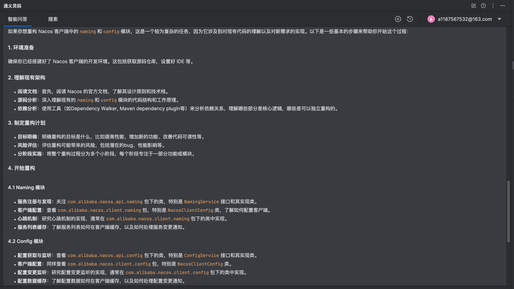
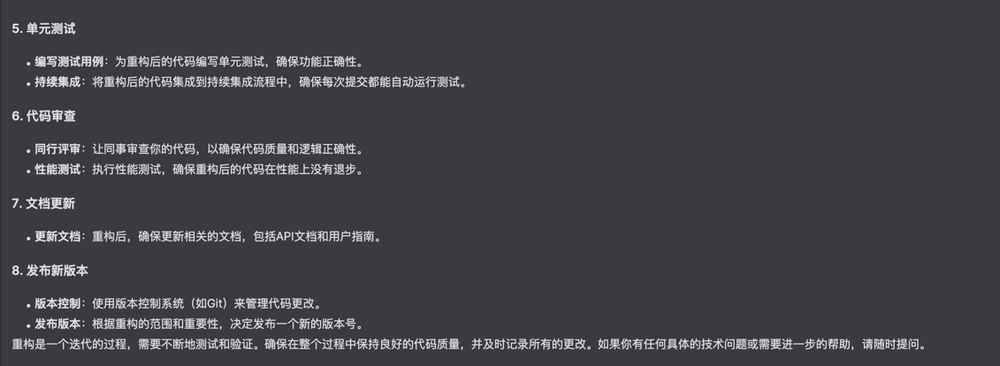
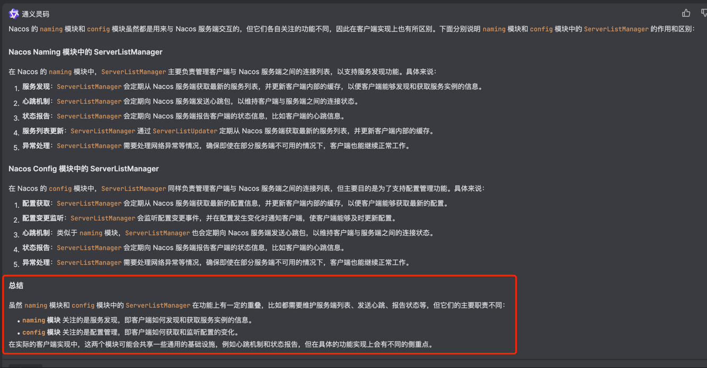
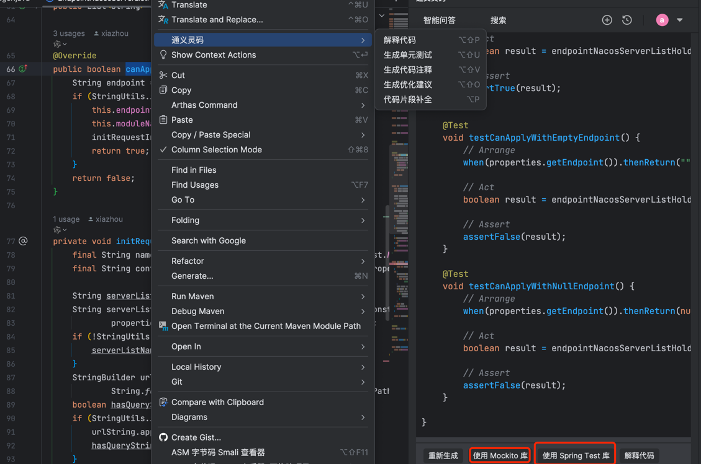

## 一. 参赛背景
本次比赛参与的开源项目是
`利用通义灵码，帮助 Nacos Client 统一寻址模块的代码，并提供自定义拓展能力。` 
[https://github.com/alibaba/nacos/issues/12189](https://github.com/alibaba/nacos/issues/12189)

能够参赛也是非常的机缘巧合, 作为一名工作几年的`CRUD`选手, 在当时工作量并不是很多的情况下, 由于项目中使用到了`Nacos`但只是停留在仅能使用阶段, 本着**知其然知其所以然**开始学习和阅读`Nacos`客户端的实现和源码逻辑, 正好浏览`Nacos issues`时发现了本次比赛 且课题正好是在学习的`Nacos Client`模块, 果断报名参赛(毕竟没有这么好的机会能有开源社区专家对你`code review`并提出意见和建议帮助你完成PR)。

## 二. 初赛阶段

本次赛道是使用通义灵码辅助编码, 开始编码之前直接问问神奇的**通义灵码**

可以看到已经把大部分重点步骤都已经解答出来了！对于首次参与开源的我帮助非常大, 最终我的比赛流程: 

1. **拉取源码** 一定要确认分支拉取最新代码, 然后把源码编译一次看有没有什么问题.
2. **理解代码** 通过官方文档和官方编写的原理书籍《Nacos架构&原理》（[阿里云藏经阁](https://developer.aliyun.com/ebook/)）对代码和整体架构进行深一步的理解, 阅读过后可以发现和通义灵码提到的一致, `Naming`模块特别关注`NamingService`, `Config`模块特别关注`ConfigService`
3. **开始编码** 借助通义灵码找到切入点后, 很快就在`NamingService/ConfigService`源码中找到了需要重构的关键类`ServerListManager`可以看到类名简明释义, 根据通义灵码的分析结合源码本人理解的则是这个类冗余了较多的公共功能, 最终的方案则是合并提取两个模块的`ServerListManager`功能达到重构效果.

4. **编写测试用例** 通义灵码同样也可以生成测试用例, 并且还提供了切换测试库, 也是非常实用.

5. **本地编译** 最后本地编译跑一遍测试没问题就可以准备提交PR了！
6. **提交PR** 将本地代码提交到自己的`Github`仓库后就可以在`Github`上提交`PR`.(主办方的参赛流程非常详细, 第一次提交`PR`按照流程成功提交)
7. **优化代码** 最后就是在开源社区专家的`code review`中不断的去优化和改进代码逻辑达到可以采纳的阶段。

## 三. 总结
本次参赛能够成功有效提交自己已经非常满意, 借助**通义灵码**参与开源项目`PR`从0到1的过程, 非常感谢主办发提供的平台和机会。后续自己也会持续关注**开源**和**阿里云-天池大赛**, 争取能够成为开源项目`committer`